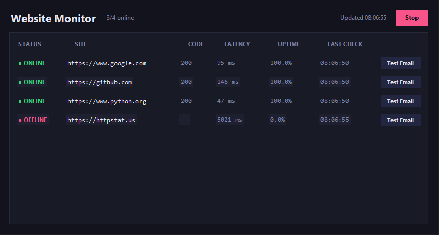

# Website Monitor

[](https://github.com/OneGoesDown/website-monitor/actions/workflows/tests.yml)


A lightweight Python tool that watches a list of websites and shows —
in a clean dark desktop app — whenever one goes down, comes back up,
or starts returning errors, along with response time and running
uptime percentage.

## Screenshots



## Features

- **Single-window desktop app** — checking and the UI run in one
  process. Just open it; no second script to remember to start.
- **Concurrent checks** — all sites are checked in parallel each cycle,
  so one slow or dead site doesn't hold up the rest.
- **Change-only logging** — only logs when a site's status actually
  changes (`ONLINE` → `OFFLINE`, etc.), not on every single check.
- **Response time & uptime tracking** — every site shows request
  latency and running uptime percentage, live.
- **Rotating logs** — the log file rotates automatically once it hits
  a configurable size, instead of growing forever.
- **Start/Stop control** — pause and resume monitoring from the app
  itself.
- **Email alerts** — get a Gmail notification when a site goes down
  (after a configurable number of consecutive failures, to avoid false
  alarms) and again when it recovers. A **Test Email** button next to
  each site lets you confirm alerts are wired up correctly anytime.
- **Configurable via environment variables** — no code changes needed
  to tune the check interval, timeout, or log location.
- **Unit tested** — core logic is decoupled from I/O (including the
  background-thread scheduling) and covered by `pytest`.

## Project structure

```
WebsiteMonitor/
├── app.py                    # Desktop app: checking + dark dashboard, one window
├── main.py                    # Headless entry point (for servers / scheduled tasks)
├── config.py                  # Settings (env-overridable, exe-aware paths)
├── conftest.py                 # Lets pytest find top-level modules during test collection
├── .env.example                # Template for local secrets (committed, no real values)
├── websites.txt                # List of URLs to monitor
├── monitor/
│   ├── checker.py              # Single-request check logic (pure, testable)
│   ├── engine.py                # Check-cycle orchestration + background thread runner
│   ├── logger_setup.py         # Rotating file + console logging
│   ├── notifier.py              # Gmail SMTP email alerts
│   └── status_store.py         # status.json read/write, used by main.py's headless mode
├── build_exe.py                 # Packages app.py into a standalone executable
├── tests/
│   ├── test_checker.py
│   ├── test_engine.py
│   ├── test_notifier.py
│   └── test_status_store.py
├── .github/workflows/
│   └── tests.yml                # Runs the test suite automatically on every push
├── logs/                      # Log output (created automatically)
├── requirements.txt
└── requirements-dev.txt
```

## Setup

```bash
git clone https://github.com/OneGoesDown/website-monitor.git
cd website-monitor
python -m venv .venv
source .venv/bin/activate   # Windows: .venv\Scripts\activate
pip install -r requirements.txt
```

## Usage

Add the URLs you want to watch to `websites.txt` (one per line, `#`
for comments), then run:

```bash
python app.py
```

That's it — one window opens, monitoring starts automatically, and the
table fills in as each site is checked. Status colors:
<span style="color:#37d67a">●</span> **online**,
<span style="color:#f5c04d">●</span> **error response**,
<span style="color:#f9548a">●</span> **offline/unreachable**.

Use the **Stop**/**Start** button in the top right to pause or resume
checking without closing the app.

### Building a standalone executable

To turn it into a double-click executable (no Python install required
to run it):

```bash
pip install pyinstaller
python build_exe.py
```

This produces `dist/WebsiteMonitor` (`.exe` on Windows) plus a copy of
`websites.txt` next to it. Edit that copy to change which sites it
watches — it's deliberately not baked into the executable.

`config.py` resolves `websites.txt`, `logs/`, and `status.json`
relative to wherever the running app actually lives (the script's
folder when run from source, or the `.exe`'s own folder when frozen)
rather than the current working directory — so it behaves the same
whether you double-click it from Desktop, a USB drive, or anywhere
else you move the folder.

### Headless / server mode

If you want to run the checks unattended — on a server, in a scheduled
task, or feeding some other tool — `main.py` still works standalone,
with no GUI:

```bash
python main.py
```

It logs the same way and additionally writes a `status.json` snapshot
after every check cycle, which any script can read to get current
status without needing `tkinter` at all.

## Email alerts

You'll get a Gmail email when a site goes down (after a configurable
number of consecutive failed checks, so one flaky timeout doesn't set
off an alarm) and another when it recovers.

Credentials are read from a local `.env` file that is **never
committed to git** — `.env.example` (which *is* committed) shows the
variable names with placeholder values so anyone cloning the repo
knows what to set up, without ever seeing your real address or
password.

### 1. Generate a Gmail app password

Google blocks plain-password logins from scripts, so you need a
16-character "app password" instead of your real one:

1. Go to [myaccount.google.com/security](https://myaccount.google.com/security)
2. Turn on **2-Step Verification** if it isn't already on — Google
   requires this before it'll let you create an app password
3. Go to [myaccount.google.com/apppasswords](https://myaccount.google.com/apppasswords)
   (or search "App Passwords" from your account settings)
4. Give it a name (e.g. "Website Monitor") and create it
5. Google shows you a 16-character password like `abcd efgh ijkl mnop`
   — copy it now, you won't be able to see it again

### 2. Add it to your `.env` file

In the project folder, copy the template and fill it in:

```bash
cp .env.example .env
```

Then edit `.env`:

```
GMAIL_ADDRESS=your-email@gmail.com
GMAIL_APP_PASSWORD=abcdefghijklmnop
```

(Spaces in the app password are fine either way.) Save the file —
that's it. `.env` is already in `.gitignore`, so it will never be
picked up by `git add` or pushed to GitHub.

By default, alerts are sent to `GMAIL_ADDRESS` itself. To send them
somewhere else instead, add `ALERT_EMAIL_TO=other-address@example.com`
to `.env`.

If `.env` is missing or incomplete, the app still runs fine — it just
logs one warning and skips email alerts.

### Verifying it works

Each row in the app has a **Test Email** button. Click it to send a
one-off email immediately, with that site's current latency, without
waiting for a real outage. It briefly shows **Sending...**, then
**Sent ✓** or **Failed ✕** depending on the result.

## Configuration

All settings live in `config.py` and can be overridden with
environment variables of the same name:

| Variable                  | Default                  | Description                                                  |
|---------------------------|--------------------------|--------------------------------------------------------------|
| `CHECK_INTERVAL`          | `30`                     | Seconds between check cycles                                 |
| `REQUEST_TIMEOUT`         | `5`                      | Seconds before a request is considered timed out             |
| `WEBSITES_FILE`           | `websites.txt`           | Path to the list of URLs                                     |
| `LOG_FILE`                | `logs/monitor.log`       | Path to the log file                                         |
| `LOG_MAX_BYTES`           | `1000000`                | Log file size (bytes) before rotation                        |
| `LOG_BACKUP_COUNT`        | `3`                      | Number of rotated log files to keep                          |
| `OK_STATUS_MAX`           | `400`                    | HTTP status codes below this count as online                 |
| `STATUS_FILE`             | `status.json`            | Snapshot file written by `main.py`'s headless mode           |
| `GUI_REFRESH_MS`          | `2000`                   | How often (ms) `app.py` refreshes its display                |
| `GMAIL_ADDRESS`           | *(none)*                 | Gmail address alerts are sent from — set in `.env`, not here |
| `GMAIL_APP_PASSWORD`      | *(none)*                 | Gmail app password — set in `.env`, not here                 |
| `ALERT_EMAIL_TO`          | same as `GMAIL_ADDRESS`  | Where alert emails are sent                                  |
| `ALERT_FAILURE_THRESHOLD` | `2`                      | Consecutive failed checks before a DOWN alert fires          |

Relative paths (all the defaults above) are resolved next to the
running app, not the current working directory — see "Building a
standalone executable" above.

Example:

```bash
CHECK_INTERVAL=60 REQUEST_TIMEOUT=10 python app.py
```

## Running tests

```bash
pip install -r requirements-dev.txt
pytest
```

The same command runs automatically on every push via
[GitHub Actions](.github/workflows/tests.yml), across Python 3.10–3.12
— that's what the "Tests" badge at the top of this README reflects.

## Possible next steps

- Email/Slack/webhook alerts on status change
- Uptime history graphs (not just current %) in the app
- Persisting history to SQLite instead of a flat log file
- Docker packaging for the headless mode
- System tray icon so the app can run minimized

## License

MIT — see [LICENSE](LICENSE).
